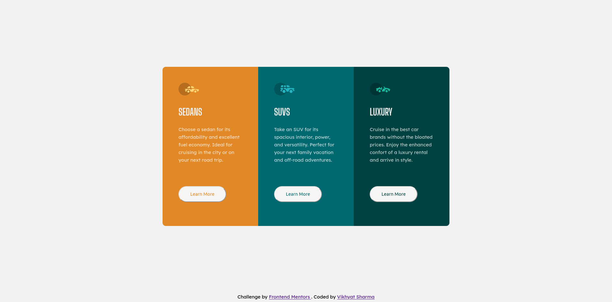

- What is this project?
- What challenges i faced?
- What am I proud of?
- Links

# Frontend Mentors - 3-Column-Preview-Card-Component
This is a solution to the [3-column preview card component challenge on Frontend Mentor](https://www.frontendmentor.io/challenges/3column-preview-card-component-pH92eAR2-). Frontend Mentor challenges help you improve your coding skills by building realistic projects. 

## Table of Contents
- [Overview](#overview)
  - [The challenge](#the-challenge)
  - [Screenshot](#screenshot)
  - [Links](#links)
- [My process](#my-process)
  - [Built with](#built-with)
  - [What I learned](#what-i-learned)
  - [Useful resources](#useful-resources)
- [Author](#author)

## Overview

### The Challenge

Users should be able to:

- View the optimal layout depending on their device's screen size
- See hover states for interactive elements

### Screenshot

#### Desktop View

#### Mobile View
[Mobile Preview 1](screenshots/mobile-screenshot-1.png) |
[Mobile Preview 2](screenshots/mobile-screenshot-2.png)

### Links
- Live Site URL: [Live Site URL](https://vikhyatsharma17.github.io/3-Column-Preview-Card-Component/)
- Solution URL: [Code URL](https://github.com/VikhyatSharma17/3-Column-Preview-Card-Component)

## My Process

### Built With
- Semantic HTML5 markup
- CSS custom properties
- Flexbox
- Mobile-first workflow

### What I learned

This challenge helped me with polishing my CSS skills related to flexboxes. 

### Useful Resources
- [Kevin Powell](https://www.youtube.com/kepowob/featured): I really learned a lot of things through his Youtube channel. He has covered a lot of topics and explains conepts with a lot of ease. Do check it out channel.

## Author
- Frontend Mentor - [@VikhyatSharma17](https://www.frontendmentor.io/profile/VikhyatSharma17)
- Twitter - [@Vikhyat1701](https://twitter.com/Vikhyat1701)

